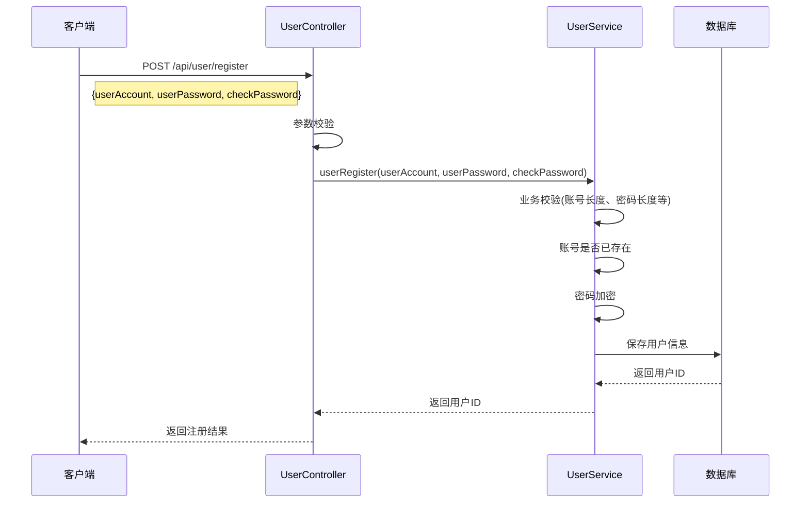
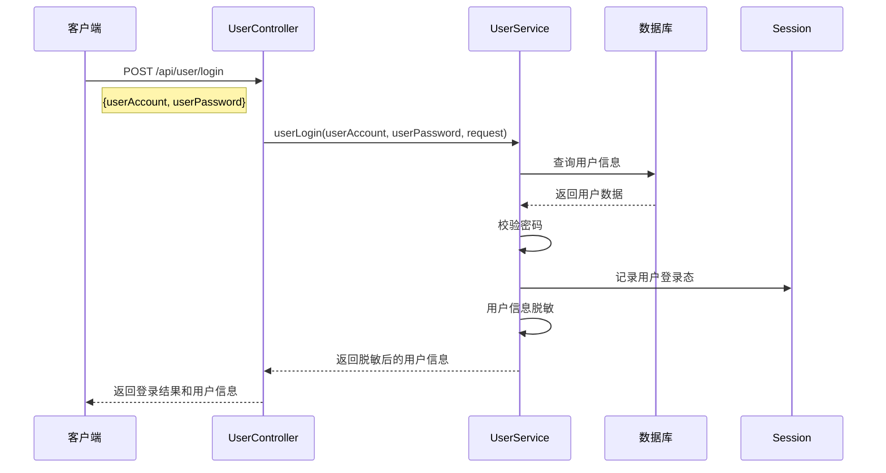
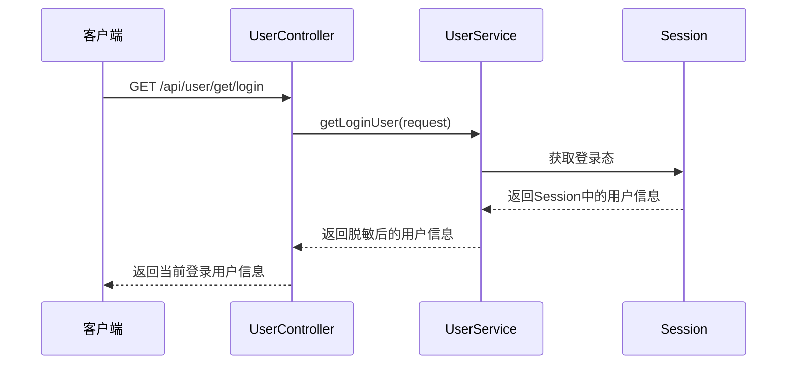
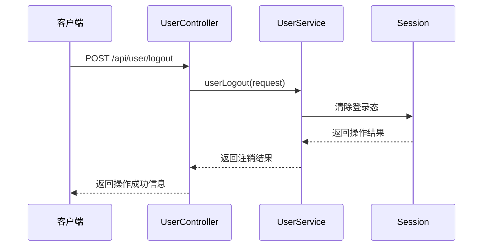
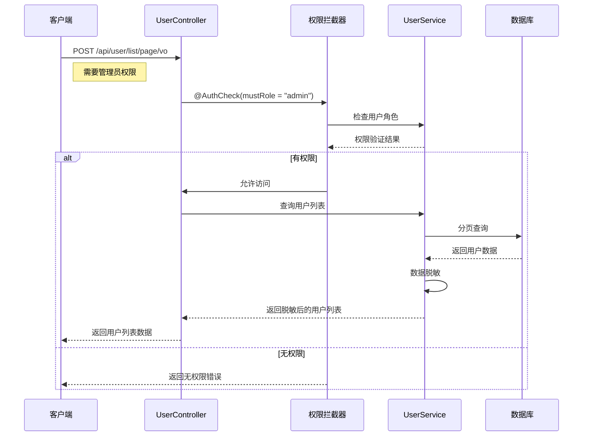

# SpringBoot Web应用开发模板

这是一个基于SpringBoot和Vue3的全栈Web应用开发模板，提供了完整的用户管理系统和前后端分离架构，帮助开发者快速搭建高质量的Web应用。

## 项目特点

- **前后端分离架构**：后端基于SpringBoot，前端基于Vue3+TypeScript+Vite
- **完整的用户系统**：包含注册、登录、注销、权限控制等功能
- **数据库支持**：集成MySQL和MyBatisFlex，简化数据库操作
- **Redis支持**：使用Redis进行缓存和Session管理
- **统一响应处理**：规范的API响应格式和全局异常处理
- **权限控制**：基于注解的权限校验系统
- **API文档**：集成Knife4j和SpringDoc，自动生成API文档
- **前端组件库**：使用Ant Design Vue构建美观的用户界面
- **状态管理**：使用Pinia进行前端状态管理

## 技术栈

### 后端

- SpringBoot 3.x
- MyBatisFlex (增强的ORM框架)
- MySQL
- Redis
- Spring Session
- Knife4j & SpringDoc (API文档)

### 前端

- Vue 3
- TypeScript
- Vite
- Ant Design Vue
- Pinia (状态管理)
- Vue Router

## 项目结构

### 后端结构

```
src/main/java/com/chengfu/springbootinit/
├── annotation        # 自定义注解
├── aop              # 面向切面编程
├── common           # 通用类
├── config           # 配置类
├── constant         # 常量
├── controller       # 控制器
├── exception        # 异常处理
├── generator        # 代码生成器
├── mapper           # 数据访问层
├── model            # 数据模型
│   ├── dto          # 数据传输对象
│   ├── entity       # 实体类
│   ├── enums        # 枚举类
│   └── vo           # 视图对象
├── service          # 服务层
│   └── impl         # 服务实现
└── SpringbootinitApplication.java  # 应用入口
```

### 前端结构

```
vue-front-init/
├── public           # 静态资源
├── src              # 源代码
│   ├── api          # API接口
│   ├── assets       # 资源文件
│   ├── components   # 公共组件
│   ├── layouts      # 布局组件
│   ├── pages        # 页面
│   ├── router       # 路由配置
│   ├── stores       # 状态管理
│   ├── App.vue      # 根组件
│   ├── main.ts      # 入口文件
│   └── request.ts   # 请求配置
└── ...              # 其他配置文件
```

## 快速开始

### 环境要求

- JDK 17+
- Maven 3.6+
- MySQL 8.0+
- Redis 6.0+
- Node.js 16+

### 后端启动

1. 克隆项目到本地

```bash
git clone https://github.com/yourusername/springbootinit.git
cd springbootinit
```

2. 创建MySQL数据库

```sql
CREATE DATABASE IF NOT EXISTS springboot_demo;
```

3. 执行SQL脚本

```bash
mysql -u root -p springboot_demo < sql/create_table.sql
```

4. 修改配置文件

编辑 `src/main/resources/application.yml`，配置数据库和Redis连接信息：

```yaml
spring:
  datasource:
    driver-class-name: com.mysql.cj.jdbc.Driver
    url: jdbc:mysql://localhost:3306/springboot_demo
    username: your_username
    password: your_password
  
  data:
    redis:
      host: localhost
      port: 6379
      database: 0
      password: your_redis_password
```

5. 启动后端服务

```bash
mvn spring-boot:run
```

或使用IDE直接运行 `SpringbootinitApplication.java`

### 前端启动

1. 进入前端目录

```bash
cd vue-front-init
```

2. 安装依赖

```bash
npm install
```

3. 启动开发服务器

```bash
npm run dev
```

4. 构建生产版本

```bash
npm run build
```

## 核心功能

### 用户管理

- 用户注册
- 用户登录
- 用户信息修改
- 用户注销
- 用户列表查询（管理员）
- 用户删除（管理员）

### 权限控制

使用 `@AuthCheck` 注解进行权限校验：

```java
@PostMapping("/delete")
@AuthCheck(mustRole = UserConstant.ADMIN_ROLE)
public BaseResponse<Boolean> deleteUser(@RequestBody DeleteRequest deleteRequest) {
    // 只有管理员可以访问
}
```

## API接口时序图

### 用户注册流程



### 用户登录流程



### 获取当前登录用户



### 用户注销流程



### 用户管理（管理员）



## 前端调用示例

### 用户登录

```typescript
import { userLogin } from '@/api/userController';
import { useLoginUserStore } from '@/stores/loginUser';

const loginUserStore = useLoginUserStore();

// 登录请求
const handleLogin = async () => {
  try {
    const res = await userLogin({
      userAccount: 'your_account',
      userPassword: 'your_password'
    });
    
    if (res.data.code === 0 && res.data.data) {
      // 更新登录用户信息
      await loginUserStore.fetchLoginUser();
      // 登录成功后跳转
      router.push('/');
    }
  } catch (error) {
    console.error('登录失败:', error);
  }
};
```

### 获取当前用户

```typescript
import { getLoginUser } from '@/api/userController';

const fetchCurrentUser = async () => {
  const res = await getLoginUser();
  if (res.data.code === 0 && res.data.data) {
    return res.data.data;
  }
  return null;
};
```

## 自定义开发

### 添加新的实体和接口

1. 创建实体类

```java
@TableName("your_table")
public class YourEntity {
    @TableId(value = "id", type = IdType.AUTO)
    private Long id;
    
    // 其他字段
    
    // getter 和 setter
}
```

2. 创建Mapper接口

```java
public interface YourEntityMapper extends BaseMapper<YourEntity> {
}
```

3. 创建Service接口和实现

```java
public interface YourEntityService extends IService<YourEntity> {
    // 自定义方法
}

@Service
public class YourEntityServiceImpl extends ServiceImpl<YourEntityMapper, YourEntity> implements YourEntityService {
    // 实现自定义方法
}
```

4. 创建Controller

```java
@RestController
@RequestMapping("/your-entity")
public class YourEntityController {
    @Resource
    private YourEntityService yourEntityService;
    
    // 实现API接口
}
```

### 添加权限控制

使用 `@AuthCheck` 注解控制接口访问权限：

```java
@PostMapping("/admin-operation")
@AuthCheck(mustRole = "admin")
public BaseResponse<Boolean> adminOperation(@RequestBody YourRequest request) {
    // 只有管理员可以访问的操作
}
```

## 常见问题

### 1. 跨域问题

本项目已通过 `CorsConfig` 配置解决跨域问题，如需修改，请编辑 `CorsConfig.java` 文件。

### 2. 会话管理

项目使用Redis存储会话信息，会话有效期为30天，可在 `application.yml` 中修改：

```yaml
spring:
  session:
    store-type: redis
    timeout: 2592000  # 30天，单位秒
```

### 3. 密码加密

用户密码使用加密存储，可在 `UserServiceImpl.java` 中查看加密实现。

## 贡献指南

欢迎提交Issue和Pull Request，一起完善这个项目！

## 许可证

[MIT License](LICENSE)